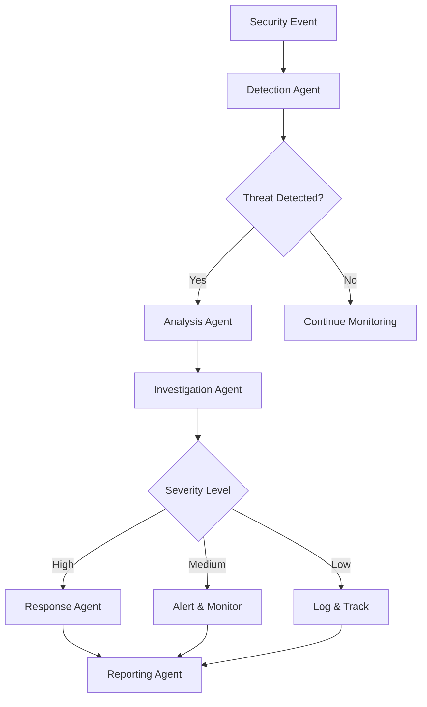

# Agentic MultiStage Threat Hunting and Incident Response System

An intelligent, multi-agent cybersecurity system built with LangGraph for automated threat hunting, detection, analysis, and incident response.

## Overview

This project implements an agentic AI system that orchestrates multiple specialized agents to perform comprehensive threat hunting and incident response operations. The system uses LangGraph to coordinate agents through different stages of the security workflow.

## Features

- **Multi-Stage Threat Detection**: Automated detection across multiple security layers
- **Intelligent Threat Analysis**: AI-powered analysis of security events and anomalies
- **Automated Incident Response**: Coordinated response actions based on threat severity
- **Agent Orchestration**: LangGraph-based workflow management
- **Real-time Monitoring**: Continuous security monitoring and alerting
- **Threat Intelligence Integration**: Integration with threat intelligence feeds
- **Forensic Analysis**: Detailed investigation and evidence collection
- **🎨 Interactive Streamlit UI**: Modern web interface for threat analysis and visualization

## Architecture

The system consists of several specialized agents:

1. **Detection Agent**: Monitors logs and identifies potential threats
2. **Analysis Agent**: Analyzes detected threats and determines severity
3. **Investigation Agent**: Performs deep forensic analysis
4. **Response Agent**: Executes appropriate response actions
5. **Reporting Agent**: Generates comprehensive incident reports

## Project Structure

```
.
├── src/
│   ├── agents/          # Individual agent implementations
│   ├── graph/           # LangGraph workflow definitions
│   ├── models/          # Data models and schemas
│   ├── tools/           # Agent tools and utilities
│   └── utils/           # Helper functions
├── config/              # Configuration files
├── data/                # Sample data and test cases
├── tests/               # Unit and integration tests
├── notebooks/           # Jupyter notebooks for analysis
├── requirements.txt     # Python dependencies
└── README.md           # This file
```

## Installation

1. Clone the repository:
```bash
git clone <repository-url>
cd Praveen_Capstone1
```

2. Create a virtual environment:
```bash
python3 -m venv venv
source venv/bin/activate  # On Windows: venv\Scripts\activate
```

3. Install dependencies:
```bash
pip install -r requirements.txt
```

4. Set up environment variables:
```bash
cp .env.example .env
# Edit .env with your API keys and configuration
```

## Configuration

Create a `.env` file with the following variables:

```
OPENAI_API_KEY=your_openai_api_key
LANGCHAIN_API_KEY=your_langchain_api_key
LANGCHAIN_TRACING_V2=true
LANGCHAIN_PROJECT=threat-hunting
```

## Usage

### Option 1: Streamlit Web UI (Recommended) 🎨

Launch the interactive web interface:

```bash
streamlit run app.py
```

Then open your browser to `http://localhost:8501`

Features:
- Interactive dashboard
- Real-time threat analysis
- Visual workflow tracking
- Downloadable reports
- Sample event library

See [STREAMLIT_GUIDE.md](STREAMLIT_GUIDE.md) for detailed UI documentation.

### Option 2: Command Line Interface

#### Running the System

```bash
python src/main.py
```

#### Running with Sample Data

```bash
python src/main.py --input data/sample_logs.json
```

#### Interactive Mode

```bash
python src/main.py --interactive
```

## Agent Workflow



## Development

### Running Tests

```bash
pytest tests/
```

### Code Formatting

```bash
black src/
flake8 src/
```

## Contributing

Contributions are welcome! Please follow these steps:

1. Fork the repository
2. Create a feature branch
3. Make your changes
4. Add tests
5. Submit a pull request

## License

MIT License

## Contact

For questions or support, please open an issue in the repository.

## Acknowledgments

- Built with LangGraph and LangChain
- Powered by OpenAI GPT models
- Inspired by modern SOC (Security Operations Center) practices
